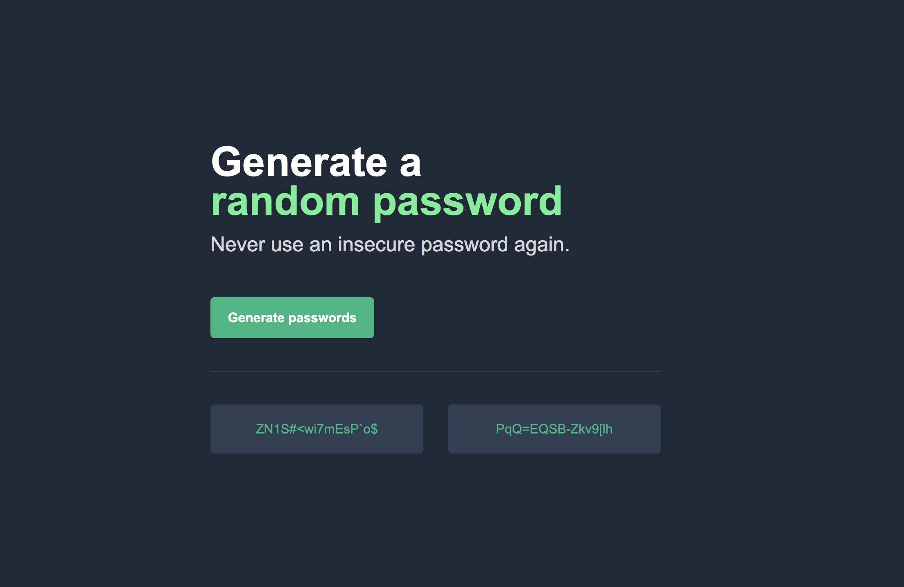

# Random Password Generator

Generate secure and random passwords with Random Password Generator. Never use an insecure password again!

## Preview

## How it Works

This project generates random passwords using a predefined set of characters. Simply click the "Generate passwords" button, and two passwords will be generated for you.

## Features

- Random password generation
- Secure password generation using a variety of characters

## Usage

1. Open the webpage in your browser.
2. Click the "Generate passwords" button.
3. Two random passwords will be displayed.
4. Click on a password to copy it to your clipboard.
5. Use the copied password wherever you need it.

## Technologies Used

- HTML
- CSS
- JavaScript

## How to Run

- [Click Here!](https://dennis-gega.github.io/Random-Password-Generator/)

---
